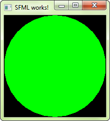

# Arkanoid Game

Para desenvolver este jogo, como parte dos meus estudos em programação, utilizei a documentação da API SFML juntamente com as aulas do curso.


## Instalação do SFML e configuração no Visual Studio Community
A instalação e configuração da API está descrita em detalhes em [Learn -> Tutorials](https://www.sfml-dev.org/learn.php).

Há também informações sobre a configuração no Code::Blocks, Linux, Xcode e CMake.

## Tutorial rápido de configuração e uso deste repositório

- Criar o diretório API_SFML e fazer o [download](https://www.sfml-dev.org/download.php) do SFML para Visual Studio (utilizei Visual C++ 15 (2017) - 32-bit);
- Descompactar o arquivo no diretório criado e renomeá-lo para SFML (irá facilitar mais adiante);
- Abrir o Visual Studio, criar um novo projeto (chamei de ArkanoidGame) e salvar no diretório API_SFML criado anteriormente;
- Criar um arquivo main.cpp
- Abrir as propriedades do projeto no menu Project e depois em Properties;
- Em Configuration, selecionar All Configurations;
- Em Platform, Active(Win32);
- Clicar em C/C++, General, Additional Include Directories, Edit, clicar em New Line, inserir ``` $(SolutionDir)..\SFML\include ```, Ok e Apply;
- Clicar em Linker, Additional Library Directories, Edit, clicar em New Line, inserir ``` $(SolutionDir)..\SFML\lib ```, Ok e Apply;
- Em Configuration, selecionar Release;
- Clicar em Linker, Input, Additional Dependencies e Edit;
- Adicionar:
```
sfml-graphics.lib

sfml-system.lib

sfml-network.lib

sfml-window.lib

sfml-audio.lib
```
- Clicar em Ok e Aplicar;
- Em Configuration, selecionar Debug;
- Clicar em Linker, Input, Additional Dependencies e Edit;
- Adicionar:
```
sfml-graphics-d.lib

sfml-system-d.lib

sfml-network-d.lib

sfml-window-d.lib

sfml-audio-d.lib
```
- Clicar em Ok e Aplicar;
- No diretório SFML, localizado em API_SFML, copiar todos os arquivos .dll do diretório bin;
- Colar os arquivos dentro do diretório ArkanoidGame;
- Copiar o código fonte do arquivo testeSFML.txt ou direto do site ([Learn -> Tutorials](https://www.sfml-dev.org/learn.php)) no main.cpp;
- Compilar e executar (Ctrl + F5);
- Se tudo estiver correto irá aparecer a imagem abaixo (retirada do site oficial).



- Copiar o diretório arkanoid deste repositório dentro de ArkanoidGame.

Este diretório contém as imagens e fontes utilizadas no jogo.

- Copiar o código fonte do jogo (disponível no sourceFile deste repositório) no main.cpp;
- Compilar e executar (Ctrl + F5).

Deverá abrir a tela inicial do jogo.

## Distribuição do Jogo
Criar um diretório e copiar:
- arquivos DLL;
- pasta arkanoid;
- arquivo executável (encontra-se no diretório release).

Pode-se renomear o arquivo executável.

## Links

[C++](https://isocpp.org)

[SFML](https://www.sfml-dev.org/index.php)

[Visual Studio](https://visualstudio.microsoft.com/pt-br/)

##


